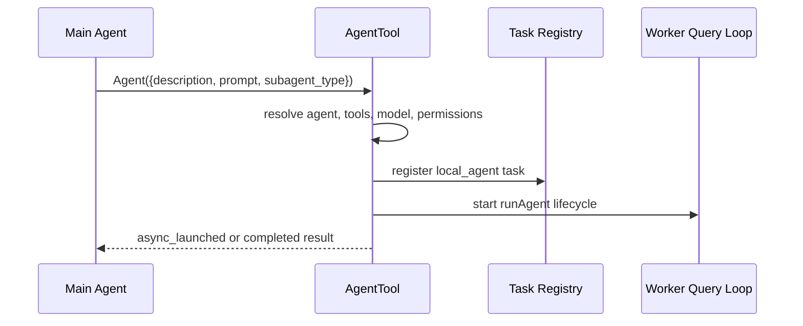
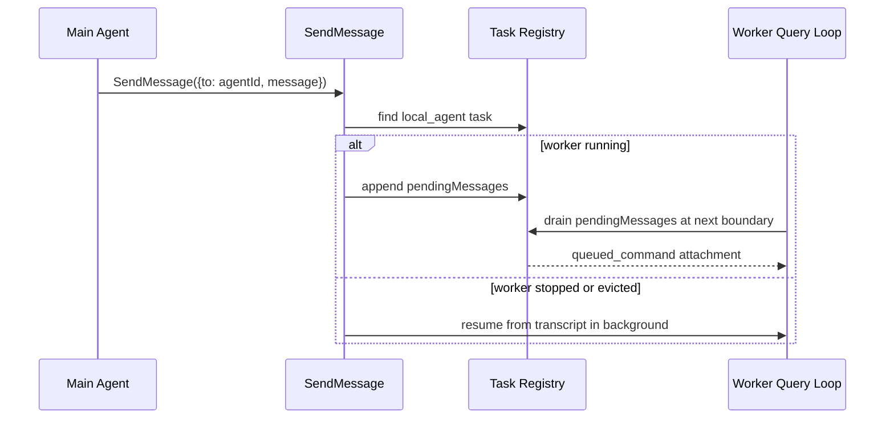
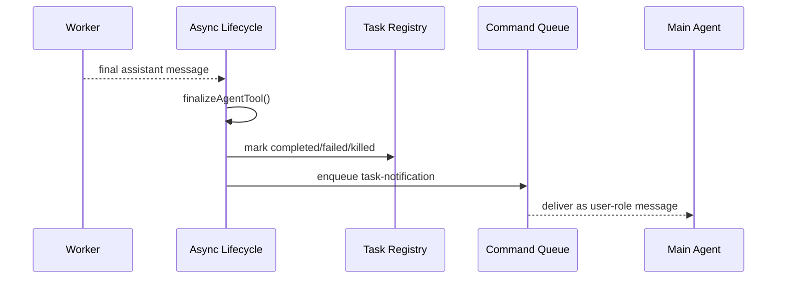
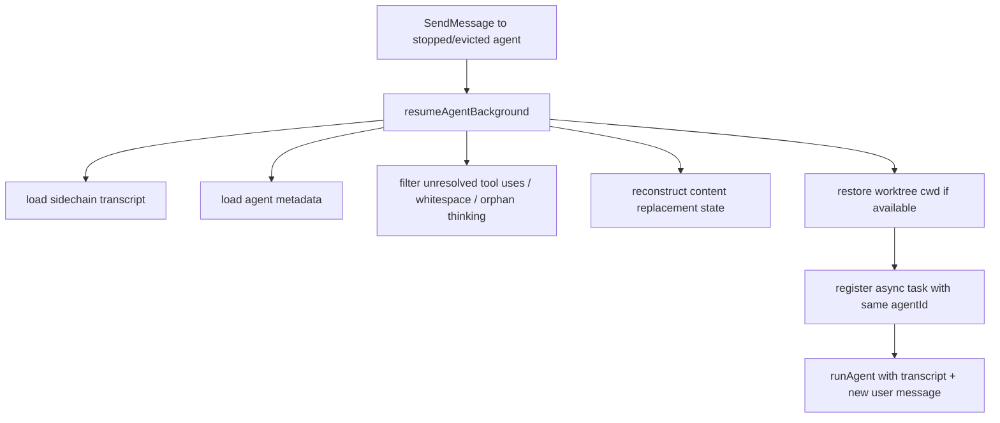
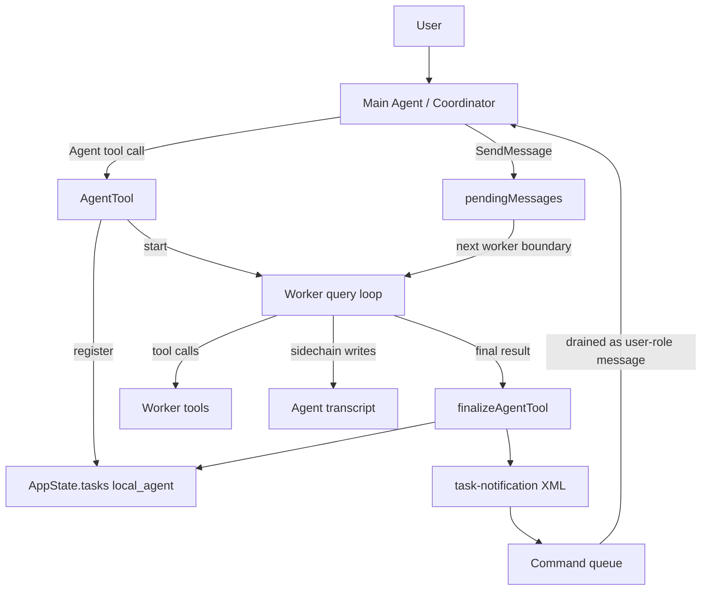

# Claude Code Internal Agent Communication Method

## 1. Purpose

This document summarizes Claude Code's internal multi-agent communication architecture as a reusable method.

The architecture is not an external Agent-to-Agent protocol such as A2A. It is an internal orchestration model where a main agent delegates work to local subagents, tracks them as background tasks, and routes results back into the main conversation through an internal command queue.

In short:

> Main agent calls tools to spawn workers. Workers run isolated query loops. Runtime state is tracked in a task registry. Messages are delivered through pending queues and task notifications. The main agent receives worker results as structured user-role messages.

## 2. Design Positioning

Claude Code separates two responsibilities:

1. Model-level orchestration
   The coordinator or main agent decides what work to delegate, which worker type to use, when to continue a worker, and when to stop one.

2. Runtime-level scheduling
   The local runtime starts workers, isolates their context, records transcripts, tracks progress, handles cancellation, and reinjects results into the main loop.

This separation keeps the model responsible for planning and synthesis, while the runtime owns lifecycle correctness.

## 3. Core Components

### 3.1 Main Agent or Coordinator

The main agent is the orchestrator. It communicates with users and decides when to delegate.

In coordinator mode, the system prompt explicitly instructs it to:

- spawn workers with `Agent`
- continue existing workers with `SendMessage`
- stop workers with `TaskStop`
- treat worker results as internal signals, not as normal user messages
- synthesize worker results before acting on them

Relevant implementation:

- `src/coordinator/coordinatorMode.ts`
- `src/tools/AgentTool/AgentTool.tsx`

### 3.2 Agent Tool

`AgentTool` is the spawn boundary. It converts a model tool call into a worker execution.

Its responsibilities include:

- resolve the requested agent definition
- choose model, permission mode, and tool set
- decide synchronous vs asynchronous execution
- optionally create an isolated worktree
- register a background task
- start the worker lifecycle
- return either a synchronous result or an `async_launched` result

`AgentTool` is marked concurrency-safe, so multiple Agent calls emitted in the same model turn can be scheduled concurrently by the tool orchestration layer.

Relevant implementation:

- `src/tools/AgentTool/AgentTool.tsx`
- `src/services/tools/toolOrchestration.ts`

### 3.3 Worker Agent

A worker is not a separate protocol peer. It is another `query()` loop running with its own `ToolUseContext`.

Each worker receives:

- an `agentId`
- an agent type
- its own system prompt
- its own available tools
- its own permission behavior
- its own transcript sidechain
- its own abort controller
- optional inherited context for forked agents

Relevant implementation:

- `src/tools/AgentTool/runAgent.ts`
- `src/utils/agentContext.ts`
- `src/utils/forkedAgent.ts`

### 3.4 Task Registry

Asynchronous workers are represented as `local_agent` tasks in `AppState.tasks`.

The task record stores:

- task status: `running`, `completed`, `failed`, or `killed`
- `agentId`
- prompt and description
- selected agent type
- abort controller
- progress counters
- queued follow-up messages
- retained transcript display state

Relevant implementation:

- `src/tasks/LocalAgentTask/LocalAgentTask.tsx`

### 3.5 Command Queue

Worker completion is routed through the unified command queue.

When a worker finishes, Claude Code creates a `<task-notification>` XML message and enqueues it as a pending notification. The main loop later drains the queue and feeds the notification back to the main agent as a user-role message.

This makes worker completion asynchronous without requiring direct agent-to-agent sockets or RPC.

Relevant implementation:

- `src/utils/messageQueueManager.ts`
- `src/cli/print.ts`

## 4. Communication Channels

Claude Code has three main internal communication channels.

### 4.1 Spawn Channel

The main agent starts a worker by calling `Agent`.

Flow:



Key property:

The worker prompt must be self-contained. Workers do not automatically see the user's full conversation unless the fork path explicitly passes inherited context.

### 4.2 Follow-up Channel

The main agent continues a worker with `SendMessage`.

For local subagents, `SendMessage` first tries to resolve the `to` field as:

- a registered agent name
- a raw `agentId`
- an existing local task
- a persisted transcript that can be resumed

If the worker is running, the message is appended to `pendingMessages`. It is not delivered immediately. It is drained at the worker's next tool-round boundary and injected as a queued command attachment.

Flow:



Key property:

Follow-up delivery is boundary-based, not interrupt-based. The runtime waits until the worker reaches a safe point in its query/tool loop.

### 4.3 Completion Channel

When a worker reaches a terminal state, the runtime creates a task notification.

Notification shape:

```xml
<task-notification>
  <task-id>{agentId}</task-id>
  <output-file>{path}</output-file>
  <status>completed|failed|killed</status>
  <summary>{summary}</summary>
  <result>{final worker response}</result>
  <usage>
    <total_tokens>N</total_tokens>
    <tool_uses>N</tool_uses>
    <duration_ms>N</duration_ms>
  </usage>
</task-notification>
```

Flow:



Key property:

The main agent does not poll the worker directly. It reacts when the runtime reinjects the notification.

## 5. Scheduling Method

### 5.1 Tool-level Scheduling

`query.ts` collects tool calls from a model response and passes them to `runTools()`.

`runTools()` partitions tool calls into:

- concurrency-safe batches
- serial batches

Concurrency-safe tools can run together, up to `CLAUDE_CODE_MAX_TOOL_USE_CONCURRENCY`, defaulting to 10.

Since `AgentTool.isConcurrencySafe()` returns true, multiple worker spawns in the same model response can run concurrently.

### 5.2 Worker-level Scheduling

After spawn, a worker can run:

- synchronously, blocking the parent turn until done
- asynchronously, as a detached background lifecycle
- initially foreground, then backgrounded later

Async workers are registered as tasks and continue independently. Their abort controller is intentionally not linked to normal main-thread cancellation, so pressing escape in the main turn does not automatically kill already-backgrounded workers.

### 5.3 Main-loop Scheduling

The main loop drains queued commands, then checks whether background tasks are still running.

In headless or print mode, it loops until:

- no main-thread command remains
- no relevant background task remains running

This is how completion notifications are picked up and fed back to the model.

## 6. Lifecycle Boundaries

Claude Code uses multiple cleanup boundaries.

### 6.1 Logical Completion

`finalizeAgentTool()` defines the worker's logical completion boundary.

It extracts:

- final text content
- total duration
- total token count
- total tool-use count
- usage from the final assistant message

It also emits analytics and cache eviction hints.

### 6.2 Task State Completion

The task state boundary is managed by:

- `completeAgentTask`
- `failAgentTask`
- `killAsyncAgent`

These functions update status, clear abort controllers, unregister cleanup handlers, set eviction timing, and remove task output where applicable.

### 6.3 Runtime Cleanup

`runAgent` has a `finally` block that cleans worker-scoped runtime state:

- agent-specific MCP clients
- agent-scoped hooks
- prompt cache tracking
- cloned file read state
- transcript subdir mapping
- todos for that agent
- background shell tasks spawned by the agent
- monitor tasks spawned by the agent

`runAsyncAgentLifecycle` also clears invoked skills and prompt dump state.

### 6.4 Worktree Cleanup

If an agent runs in isolated worktree mode, the runtime checks whether the worktree changed.

- If unchanged, the worktree can be removed.
- If changed, it is kept and included in the task notification.

This lets worker edits remain inspectable without leaking unused temporary worktrees.

## 7. Isolation Model

Claude Code isolates workers along several axes.

### 7.1 Context Isolation

Workers receive a `createSubagentContext()` result rather than directly sharing the parent context.

Async workers generally do not share `setAppState`, except through `setAppStateForTasks` for session-scoped infrastructure such as task registration and hooks.

### 7.2 Identity Isolation

`AsyncLocalStorage` tracks the current agent identity across async operations.

This prevents concurrent background agents from overwriting each other's attribution state.

### 7.3 Tool Isolation

Worker tools are resolved from the agent definition and filtered based on:

- built-in vs custom agent
- async vs sync execution
- disallowed tool lists
- explicit tool declarations
- MCP availability

Async workers are restricted from tools that require interactive UI unless the permission mode allows bubbling prompts to the parent.

### 7.4 Filesystem Isolation

Optional worktree isolation creates a temporary git worktree for the worker. Forked workers receive a notice explaining that inherited paths refer to the parent cwd and must be translated to the worktree cwd.

## 8. Resume Method

A stopped or evicted worker can be resumed if its sidechain transcript exists.

Resume flow:



Key property:

Resume continues the same conceptual worker by reusing transcript and metadata, but it starts a new async lifecycle.

## 9. Method Summary

Claude Code's internal agent communication can be summarized as:



The reusable method is:

1. Treat each worker as a task, not as a chat peer.
2. Give every worker a durable identity.
3. Isolate worker context, tools, permissions, and cleanup.
4. Deliver follow-up messages at safe execution boundaries.
5. Return results through a single structured notification channel.
6. Persist transcripts so stopped workers can be resumed.
7. Let the coordinator synthesize results instead of letting workers coordinate each other directly.
8. Make runtime state transitions explicit: running, completed, failed, killed.
9. Clean resources at both query-loop and task-lifecycle boundaries.

## 10. Difference From A2A

This architecture is not A2A-style network communication.

| Dimension | Claude Code Internal Agents | A2A-style Agent Communication |
| --- | --- | --- |
| Boundary | Same local runtime | Cross process or cross service |
| Transport | AppState, command queue, attachments | HTTP, JSON-RPC, SSE or push |
| Discovery | Local agent definitions | Agent Card |
| Result delivery | `<task-notification>` XML | Task status, messages, artifacts |
| Resume | Sidechain transcript | Protocol-defined task/session state |
| Primary goal | Internal orchestration | External interoperability |

The conceptual overlap is task-oriented asynchronous collaboration. The implementation is different: Claude Code uses an internal task bus, while A2A uses an external protocol.

