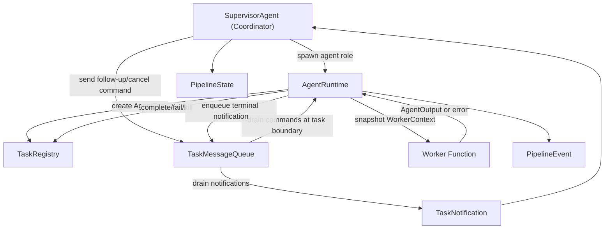

# Multi-Agent Runtime Refactor Design

> Version: 0.1.0 | Date: 2026-06-23 | Scope: `contract_agent/orchestration/`

## 1. Goal

Refactor the current multi-agent orchestration block from "Supervisor directly calls Python agent functions" into an internal local multi-agent runtime inspired by Claude Code's internal agent communication method.

This design is not an external A2A protocol. It is an in-process runtime model:

1. The coordinator decides which workers to spawn and how to synthesize results.
2. The runtime owns task identity, lifecycle state, message delivery, cancellation boundaries, notifications, and observability.
3. Workers remain local callable units in phase 1, but they execute through a task runtime boundary instead of being called directly by the supervisor.

## 2. Current State

Current orchestration has useful foundations:

- `protocol.py` defines `PipelineState`, `AgentOutput`, and `PipelineEvent`.
- `SupervisorAgent` uses a ReAct loop and `ThreadPoolExecutor` to call registered agent functions.
- `PipelineOrchestrator` supports sequential queue execution.
- `EventPublisher` publishes pipeline events through callbacks and Redis Pub/Sub.
- `MemoryManager` persists final pipeline outputs to hot and warm memory.

Key gaps:

- `agent_id` is a role name, not a durable task/run identity.
- There is no task registry for running/completed/failed/killed worker tasks.
- There is no internal command queue for follow-up messages, cancellation, or task notifications.
- Worker functions share context by convention and do not have a runtime isolation boundary.
- Parallel execution does not model data dependencies. A dependent agent can be scheduled in the same round before upstream outputs are available.
- Timeout only times out `future.result`; it does not provide a task-level cancellation contract.
- Memory persistence is result-oriented and does not model running tasks, pending commands, transcripts, or resume checkpoints.
- Observability is missing per-task notifications, progress counters, transcript paths, usage fields, and duplicate notification handling.

## 3. Architecture Principles

### 3.1 Coordinator/runtime split

The coordinator is responsible for:

- choosing agent roles;
- grouping agents into executable batches;
- deciding whether to continue, finish, or fail a pipeline;
- synthesizing `AgentOutput` objects into the final review report.

The runtime is responsible for:

- creating stable task identities;
- storing task lifecycle state;
- executing workers through a single spawn boundary;
- queuing follow-up and cancel commands;
- producing task notifications;
- emitting lifecycle events;
- isolating failures and cleanup.

### 3.2 Task-oriented communication

Workers are tasks, not chat peers. The coordinator does not let workers call each other directly.

All worker communication goes through:

- spawn requests;
- queued task commands;
- task notifications;
- pipeline state aggregation.

### 3.3 Phase-1 compatibility

Phase 1 keeps the current public behavior:

- existing agent functions still return `AgentOutput`;
- existing `SupervisorAgent.run()` still returns `PipelineState`;
- existing event names remain valid;
- no protobuf or generated gRPC file change is required.

## 4. Proposed Runtime Model



## 5. Core Protocol Additions

### 5.1 `AgentTaskStatus`

Task runtime status is separate from business `AgentStatus`.

Allowed values:

- `pending`: task has been registered but not started;
- `running`: worker is executing;
- `completed`: worker returned an `AgentOutput`;
- `failed`: worker raised an exception or returned invalid output;
- `cancel_requested`: cancellation was requested and will be observed at the next safe boundary;
- `killed`: runtime ended the task after cancellation or timeout;
- `cancelled`: coordinator cancelled the task before execution.

### 5.2 `AgentTask`

Each worker execution gets a durable task record:

- `task_id`: stable conceptual task id for one coordinator-spawned worker task;
- `pipeline_id`;
- `agent_id`: role name such as `parser` or `risk_checker`;
- `run_id`: one worker lifecycle attempt;
- `status`;
- `input_summary`;
- `progress`;
- `pending_command_count`;
- `attempt`;
- `created_at`, `started_at`, `completed_at`;
- `timeout_seconds`;
- `transcript_path` for future durable transcript support;
- `output` and `error_message`.

Identity rules:

- `agent_id` is the stable role name, for example `parser`.
- `task_id` is the stable conceptual task id for one coordinator-spawned worker task. A resumed task keeps the same `task_id`.
- `run_id` identifies one lifecycle attempt for that task. Resume creates a new `run_id`.
- terminal notification idempotency key is `(task_id, run_id, status)`.
- follow-up and cancel targets are resolved in this order: exact `task_id`, active `agent_id` within the pipeline, transcript-backed `task_id` in future warm storage. Phase 1 supports exact `task_id` and active `agent_id` only.

### 5.3 `TaskCommand`

Commands are queued by task id:

- `follow_up`: append coordinator instructions to a running task;
- `cancel`: request cancellation;
- `heartbeat`: update progress or keep a task alive.

Commands are drained at safe task boundaries:

- before worker start;
- after worker completion;
- before final notification emission.

Phase 1 workers are synchronous Python callables, so follow-up cannot interrupt an in-flight function. The command contract still exists and is observable, and future async/query-loop workers can drain commands during tool-round boundaries.

### 5.4 `TaskNotification`

Every terminal task produces a notification:

- `task_id`;
- `pipeline_id`;
- `agent_id`;
- `run_id`;
- `status`;
- `summary`;
- `output`;
- `error_message`;
- `duration_ms`;
- `token_used`;
- `llm_calls`;
- `tool_uses`;
- `transcript_path`;
- `created_at`.

Notifications are the single completion channel from runtime back to the coordinator.

Runtime enqueues terminal notifications into `TaskMessageQueue`, not directly into the coordinator. The coordinator drains notifications by pipeline id after each spawn batch. Duplicate terminal notifications with the same idempotency key are ignored.

### 5.5 State transition table

| From | To | Reason |
| --- | --- | --- |
| `pending` | `running` | worker execution starts |
| `pending` | `cancelled` | cancel command is drained before start |
| `running` | `completed` | worker returns completed/skipped business output |
| `running` | `failed` | worker raises or returns invalid output |
| `running` | `cancel_requested` | cancel command observed while worker is in-flight |
| `running` | `killed` | timeout boundary reached |
| `cancel_requested` | `completed` | in-flight worker completed before hard termination |
| `cancel_requested` | `failed` | in-flight worker failed after cancellation request |
| `cancel_requested` | `killed` | cancellation escalated or timeout boundary reached |

Terminal states are `completed`, `failed`, `killed`, and `cancelled`. Repeating the same terminal transition is idempotent only when the idempotency key matches the already recorded terminal notification.

## 6. New Modules

### 6.1 `task_registry.py`

Responsibilities:

- create and store `AgentTask`;
- transition task state with explicit methods;
- reject invalid transitions;
- list tasks by pipeline id;
- resolve duplicate terminal notifications idempotently.

Phase 1 implementation is in-memory and thread-safe with `RLock`.

Future storage:

- hot memory stores running task snapshots with TTL;
- warm memory stores terminal task metadata and transcript indexes.

### 6.2 `message_queue.py`

Responsibilities:

- enqueue `TaskCommand` by task id;
- resolve command targets by task id or active agent id;
- drain commands at safe boundaries;
- enqueue `TaskNotification` by pipeline id;
- drain terminal notifications for the coordinator;
- deduplicate terminal notifications by `(task_id, run_id, status)`;
- count pending commands for observability;
- keep Redis Pub/Sub separate from command semantics.

Phase 1 implementation is in-memory and thread-safe.

### 6.3 `runtime.py`

Responsibilities:

- register worker callables by `agent_id`;
- spawn a worker task;
- snapshot and isolate worker input context;
- drain pending commands before execution;
- execute the worker;
- translate returned output, exceptions, timeout, and cancellation into `TaskNotification`;
- emit `PipelineEvent` lifecycle events.

Phase 1 uses a long-lived `ThreadPoolExecutor` owned by `AgentRuntime`, never a `with ThreadPoolExecutor(...)` block inside each spawn. On timeout, runtime calls `future.cancel()`, records `killed`, enqueues a killed notification, and returns to the coordinator without waiting for the worker thread. `AgentRuntime.close(wait=False)` is responsible for non-blocking shutdown. If a timed-out callable later returns, the registry ignores the late result because the task is already terminal.

This does not claim hard cancellation of Python threads or remote LLM calls. It only guarantees the coordinator receives a timely killed notification.

Because a timed-out callable can still occupy an executor worker, runtime must track timed-out-but-not-returned futures. If that count reaches `max_parallel_agents`, spawn should apply backpressure by failing new tasks fast with a clear capacity error or by emitting an alert event before queueing. Phase 2 should replace this with a cancellable async worker loop.

## 7. Supervisor Changes

`SupervisorAgent` keeps the ReAct decision loop but stops directly calling worker functions.

### 7.1 Agent registration

`SupervisorAgent.register_agent(agent_id, fn)` delegates registration to `AgentRuntime`.

### 7.2 Batch planning

The supervisor converts the LLM decision's agent list into executable batches.

Default dependencies for review team:

```text
parser -> risk_checker -> legal_ref -> redrafter -> summarizer
```

Rules:

- agents without unmet dependencies can run in the same batch;
- agents with unmet dependencies are deferred to a later batch;
- unknown agents produce failed task notifications and failed `AgentOutput` entries;
- if a dependency fails, the dependent agent is skipped unless explicitly requested by future policy.

This prevents same-round parallel execution from hiding missing upstream data.

### 7.3 Context merge

Runtime receives a copy of `ctx` for each worker. Worker outputs are merged into coordinator context only after a notification reaches a terminal state.

No worker can mutate shared `ctx` directly.

Worker context rules:

- `AgentRuntime` snapshots context with `copy.deepcopy()` before worker execution.
- Context values must be JSON-like, Pydantic models, dataclasses, or otherwise deepcopy-safe.
- Shared service instances, open network clients, database sessions, thread locks, and mutable singleton handles must not be passed through worker context.
- If a value cannot be deep-copied, runtime fails the task before execution with a clear isolation error.
- `runtime_settings` is allowed because `Settings` is a Pydantic model and should be copied as configuration data, not as a mutable global handle.

### 7.4 Event compatibility

Existing event types remain:

- `agent_started`;
- `agent_completed`;
- `agent_failed`;
- `agent_skipped`;
- `agent_called`;
- `round_complete`;
- `supervisor_finished`.

New event data adds:

- `task_id`;
- `run_id`;
- `task_status`;
- `duration_ms`;
- `pending_command_count`;
- `transcript_path`.

## 8. Failure, Timeout, and Cancellation

### 8.1 Failure isolation

If a worker raises an exception:

- runtime marks its task `failed`;
- runtime emits a failed `TaskNotification`;
- supervisor stores a failed `AgentOutput` for that role;
- other completed worker outputs remain intact.

### 8.2 Timeout

If a worker exceeds `agent_timeout_seconds`:

- runtime marks the task `killed`;
- notification status is `killed`;
- business `AgentOutput.status` becomes `FAILED`;
- error message includes the timeout duration.

Phase 1 returns the killed notification without waiting for the underlying Python thread. A late worker result is ignored if the registry already has a terminal state for the same `task_id` and `run_id`.

### 8.3 Cancel command

If a cancel command is queued before worker start:

- runtime marks task `cancelled`;
- worker is not executed.

If a cancel command arrives while a synchronous worker is in-flight:

- runtime records `cancel_requested`;
- the final notification is still produced at task boundary;
- future async workers can observe cancellation inside their loop.

## 9. Observability

Every spawned task must be observable through:

- `AgentTask` state in `TaskRegistry`;
- `TaskNotification` terminal record;
- existing `PipelineEvent`;
- audit spans around runtime spawn and worker execution;
- usage fields from `AgentOutput`: `token_used`, `llm_calls`;
- `duration_ms` measured by runtime.

Redis Pub/Sub remains an event transport for subscribers. It is not the command queue and must not be used as the source of truth for runtime commands.

`TaskMessageQueue` is the source of truth for in-process commands and terminal notifications during phase 1. Redis Pub/Sub may publish a copy of `PipelineEvent` or notification summaries for UI subscribers, but consumers must tolerate duplicate or missing Pub/Sub messages.

## 10. Memory and Resume Strategy

Phase 1:

- keep task registry and command queue in memory;
- preserve final `PipelineState` and agent outputs through existing `MemoryManager`;
- expose transcript/checkpoint fields in protocol as nullable placeholders.

Phase 2:

- hot memory persists running task snapshots, pending command metadata, and heartbeat/progress with TTL;
- warm memory persists terminal task metadata, transcript indexes, and resume checkpoints;
- resume reconstructs an `AgentTask` from transcript metadata and starts a new `run_id`.

Non-resumable states:

- killed tasks without transcript;
- workers that executed non-idempotent side effects without checkpoint;
- tasks whose agent definition no longer exists.

## 11. Backward Compatibility

No gRPC protocol changes are required in phase 1.

Existing behavior remains:

- `ReviewMultiAgent` receives a final `PipelineState` and review report;
- `ReviewMultiAgentStream` can continue consuming `PipelineEvent`;
- direct unit tests can still assert existing event order, with extra event data allowed.

Generated files `agent_pb2.py` and `agent_pb2_grpc.py` are out of scope unless `agent.proto` is intentionally changed in a later phase.

Public API policy:

- Shared Pydantic protocol models are public and live in `protocol.py`.
- `AgentRuntime`, `TaskRegistry`, and `TaskMessageQueue` are public orchestration building blocks and must be re-exported from `contract_agent/orchestration/__init__.py`.
- Worker implementation helpers remain module-private unless a caller outside `orchestration/` needs them.
- New `impl`-style private modules must not be re-exported.

## 12. Implementation Tasks

1. Extend `protocol.py` with task runtime models.
2. Add `task_registry.py` with thread-safe state transitions.
3. Add `message_queue.py` with thread-safe command and notification enqueue/drain semantics.
4. Add `runtime.py` to execute registered worker callables and produce notifications.
5. Refactor `SupervisorAgent` to use `AgentRuntime` and dependency-aware batches.
6. Update `orchestration/__init__.py` to re-export the public runtime API.
7. Add unit tests for protocol models, registry transitions, message queue command/notification drain, runtime notifications, dependency ordering, failure isolation, context isolation, and timeout mapping.
8. Update `docs/architecture.md` after implementation stabilizes.

## 13. Acceptance Criteria

- A worker execution has a unique `task_id` and `run_id`.
- Runtime state transitions are explicit and test-covered.
- Completion flows through `TaskNotification`, not ad hoc direct returns.
- Supervisor no longer directly submits registered agent functions to a local thread pool.
- Dependent review agents do not execute before upstream outputs are merged.
- Unknown, failed, skipped, and timed-out agents produce observable failed/skipped outputs without corrupting completed outputs.
- Existing supervisor and gateway tests continue to pass.
- New tests cover P0/P1 runtime contracts.

## 14. Risks and Mitigations

| Risk | Impact | Mitigation |
| --- | --- | --- |
| In-process Python thread timeout cannot hard-cancel work | Long-running LLM calls can continue after timeout | Document limitation, mark task killed at coordinator boundary, move to async/cancellable worker loop in phase 2 |
| Repeated timed-out callables exhaust executor workers | Later tasks can starve behind stuck threads | Track unreclaimed timed-out futures, emit capacity warnings, and fail fast when runtime capacity is exhausted |
| Adding runtime models bloats `protocol.py` | Harder to maintain | Keep only shared schemas in `protocol.py`; put behavior in dedicated modules |
| Command queue exists before workers can interrupt | Misleading expectations | State phase-1 boundary explicitly; only drain at safe boundaries |
| Dependency policy becomes too rigid | Some future agents may be independently parallelizable | Store dependencies as config data and allow later override |
| Resume fields are placeholders in phase 1 | Users may assume full resume exists | Document phase split and non-resumable states |
